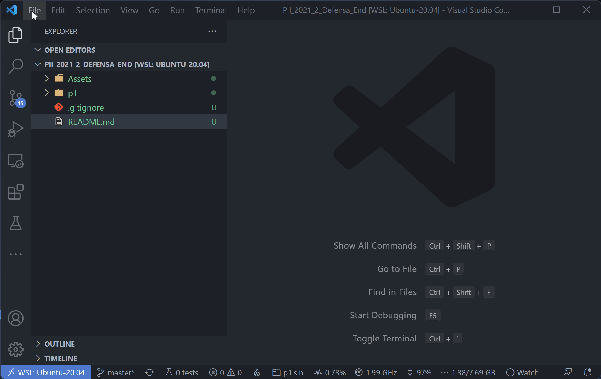
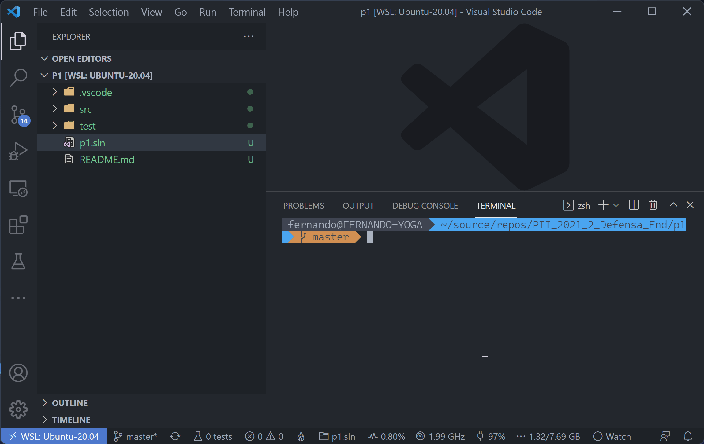
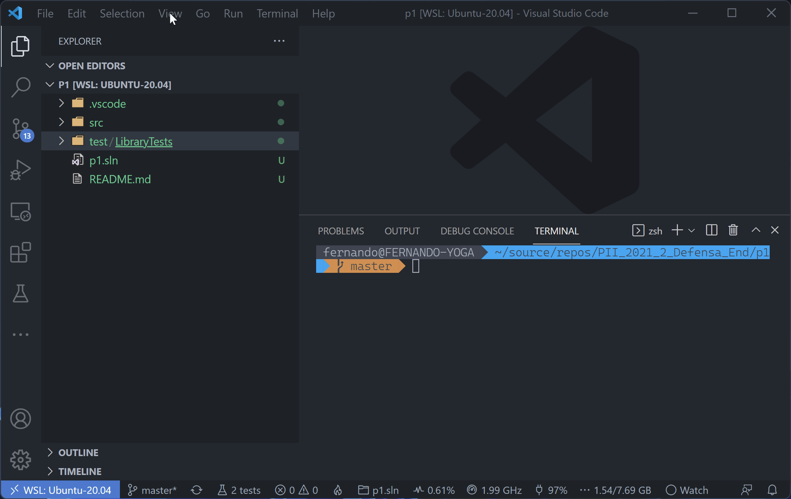

La defensa del proyecto consiste en un cuestionario en webasignatura y un repositorio en GitHub con problemas a resolver. Este es el repositorio en GitHub.

Para resolver los problemas, deben abrir en Visual Studio Code las carpetas `p1`, `p2`, etc. contenidas en este repositorio. Por ejemplo, para resolver el primer problema deben abrir la carpeta `p1` con el comando **File|Open Folder**, para resolver el segundo la carpeta `p2`, y así sucesivamente.

 

Cuando tengan la carpeta abierta, van a poder ejecutar desde la consola de Visual Studio Code los comandos `dotnet test` para compilar y ejecutar los casos de prueba.

 

También pueden usar `View|Command Palette...`, luego elegir `Task: Run Task` o `Task: Run Test Task`, y luego la tarea `Test` para ejecutar el caso de prueba.

 

Cada carpeta tiene un problema diferente. Los problemas están relacionados con el código base que ya les dimos pero son independientes, es decir, no hay que resolver un problema primero para pasar al siguiente.

